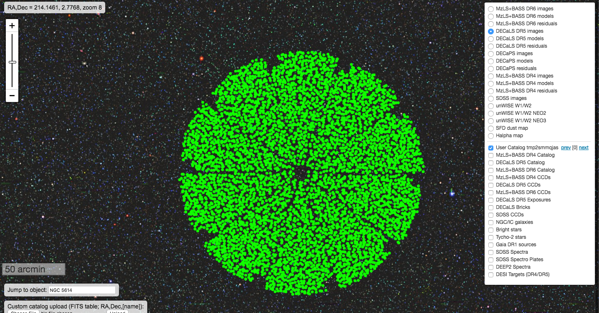
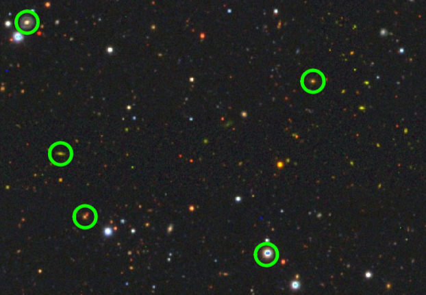

# fiberassign_sv

Running fiberassign on DECaLS data (DR5) on SV pointings using a single python script.

To run the script do the following in a login node on cori@NERSC.

```
source /project/projectdirs/desi/software/desi_environment.sh
```

```
git clone https://github.com/forero/fiberassign_sv
```

```
cd fiberassign_sv
```

```
python main.py
```

After that you can visualize a single pointing file (i.e. `output/tile_100041.fits`)
using http://legacysurvey.org/viewer/

Final outputs can be found here http://portal.nersc.gov/project/desi/users/forero/SV_BGS_v0.1/




Fiberassign for Survey Verification 
